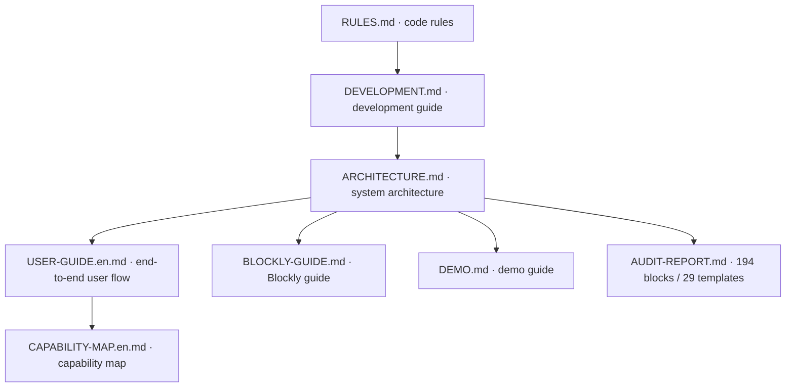

# CipherCat documentation center

🐱 **Post-Quantum Cryptography Visual Programming Platform** — built on Blockly 13.x and Vue 3 (Composition API + TypeScript).

---

## Documentation index

### 📖 User docs

| Doc | Audience | Description |
|------|------|------|
| [USER-GUIDE.en.md](./guides/USER-GUIDE.en.md) | Users | End-to-end path from project creation and demos to block assembly, code generation, verification, and backend assessment |
| [TUTORIALS.en.md](./guides/TUTORIALS.en.md) | Users | Step-by-step editor, demo import, code generation, function wrapping, and assessment tutorials with interface states and troubleshooting |
| [CAPABILITY-MAP.en.md](./guides/CAPABILITY-MAP.en.md) | Users/Researchers | Primitives, algorithm families, demos, standard references, and evidence boundaries |
| [BLOCKLY-GUIDE.en.md](./guides/BLOCKLY-GUIDE.en.md) | Users | Blockly usage guide: editor operations, type system, function templates, algorithm assembly examples |
| [DEMO.en.md](./guides/DEMO.en.md) | Users | Demo guide index (per algorithm: SM4/AES/hash/SM2/post-quantum, with official-vector verification) |

Block documentation follows one overview plus multiple details: start with the [block overview](./blocks/INDEX.en.md), then open [symmetric ciphers](./blocks/symmetric.en.md), [hash/XOF](./blocks/hash.en.md), [classical public-key/elliptic-curve cryptography](./blocks/ecc-sbox.en.md), [stream cipher](./blocks/zuc.en.md), or [post-quantum cryptography](./blocks/post-quantum.en.md). Each category page exposes uniform entry points for normative source, structured entries, source code, demos, and coverage boundaries.

### 🛠️ Development docs

| Doc | Audience | Description |
|------|------|------|
| [ARCHITECTURE.en.md](./guides/ARCHITECTURE.en.md) | Developers | System architecture, data flow, module organization |
| [SETUP.en.md](./guides/SETUP.en.md) | Developers | Local startup, production preview, desktop builds, and acceptance gates |
| [DEVELOPMENT.en.md](./guides/DEVELOPMENT.en.md) | Developers | Environment setup, adding blocks, i18n, code style |
| [TYPE-SYSTEM.en.md](./guides/TYPE-SYSTEM.en.md) | Developers | Blockly type declarations, connection checks, and explicit conversions |

### 📊 Status and audits

| Doc | Audience | Description |
|------|------|------|
| [AUDIT-REPORT.en.md](./guides/AUDIT-REPORT.en.md) | Developers | Cryptographic primitive completeness audit (including Chinese national standards) |
| [CRYPTO-RESEARCH-2026-09-12.md](./research/CRYPTO-RESEARCH-2026-09-12.md) | Developers/Researchers | Web research on standards, PQC, assurance, randomness assessment and teaching research; includes the local literature bundle |

### 🔬 Algorithm specifications

Coverage matrix (standard ↔ blocks ↔ demos ↔ templates ↔ guides): [standards/COVERAGE.en.md](./standards/COVERAGE.en.md). Extraction quality, evidence tiers, and missing items are tracked in [standards/DOCUMENT-STATUS.en.md](./standards/DOCUMENT-STATUS.en.md). The relationship between the original-source extraction layer and the structured user-reference layer is documented in [standards/SOURCE-LAYERS.en.md](./standards/SOURCE-LAYERS.en.md). Standard metadata, source snapshot dates, errata status and local PDF hashes are maintained by [`standards-manifest.json`](./standards/standards-manifest.json) and `npm run standards:check`. Documentation i18n uses `.en.md` counterparts; when a standard page has no English translation, the English view keeps an explicit source-language fallback instead of pretending it is translated. The list below contains 37 standard and reference directories; `standards/papers/` is a literature index and is not counted as an algorithm directory:

| Doc | Description |
|------|------|
| [blocks/INDEX.en.md](./blocks/INDEX.en.md) | Block standard-basis reference (split by category) |
| [COVERAGE.en.md](./standards/COVERAGE.en.md) | Standards coverage matrix (standard ↔ block ↔ Demo ↔ template ↔ guide) |
| [DOCUMENT-STATUS.en.md](./standards/DOCUMENT-STATUS.en.md) | Documentation extraction review, evidence tiers, and gap list |
| [REEXTRACTION-REPORT.en.md](./standards/REEXTRACTION-REPORT.en.md) | Standards PDF re-extraction, visual spot checks, and fix record |
| [SOURCE-QUALITY-AUDIT.en.md](./standards/SOURCE-QUALITY-AUDIT.en.md) | Source-layer quality grades for formulas, tables, font mappings, and readability |
| [FUNCTION-PRIMITIVE-INDEX.en.md](./standards/FUNCTION-PRIMITIVE-INDEX.en.md) | Function/primitive-family split index for standards references |
| [STRUCTURED-ENTRY-SCHEMA.en.md](./standards/STRUCTURED-ENTRY-SCHEMA.en.md) | Common entry fields for functions, primitives, formulas, and algorithm stages |
| [SOURCE-LAYERS.en.md](./standards/SOURCE-LAYERS.en.md) | Complete source layer versus structured reference layer |
| [SOURCE-SPLIT-COVERAGE.en.md](./standards/SOURCE-SPLIT-COVERAGE.en.md) | Source-to-entry split coverage and acceptance boundary |
| [SOURCE-SPLIT-INVENTORY.en.md](./standards/SOURCE-SPLIT-INVENTORY.en.md) | Entry-by-entry source links for 37 standard directories and 227 structured entries |
| [fips197-AES/](./standards/fips197-AES/README.md) | FIPS 197 AES reference |
| [fips180-4-SHA2/](./standards/fips180-4-SHA2/README.md) | FIPS 180-4 SHA-2 reference |
| [fips202-SHA3/](./standards/fips202-SHA3/README.md) | FIPS 202 SHA-3 / SHAKE / KECCAK-p |
| [fips198-1-hmac/](./standards/fips198-1-hmac/README.md) | FIPS 198-1 HMAC |
| [sp800-38a-modes/](./standards/sp800-38a-modes/README.md) | SP 800-38A block modes (ECB/CBC/CTR) |
| [sp800-38b-cmac/](./standards/sp800-38b-cmac/README.md) | SP 800-38B CMAC |
| [sp800-38c-ccm/](./standards/sp800-38c-ccm/README.md) | SP 800-38C CCM authenticated encryption |
| [sp800-38d-gcm/](./standards/sp800-38d-gcm/README.md) | SP 800-38D GCM authenticated encryption |
| [sp800-38e-xts/](./standards/sp800-38e-xts/README.md) | SP 800-38E XTS disk encryption |
| [sp800-90a-drbg/](./standards/sp800-90a-drbg/README.md) | SP 800-90A DRBG random generator |
| [sp800-132-pbkdf2/](./standards/sp800-132-pbkdf2/README.md) | SP 800-132 PBKDF2 |
| [sp800-232-ascon/](./standards/sp800-232-ascon/README.md) | SP 800-232 ASCON lightweight AEAD |
| [fips186-5-ecdsa/](./standards/fips186-5-ecdsa/README.md) | FIPS 186-5 ECDSA |
| [fips203-ML-KEM/](./standards/fips203-ML-KEM/README.md) | FIPS 203 ML-KEM (Kyber) |
| [fips204-ML-DSA/](./standards/fips204-ML-DSA/README.md) | FIPS 204 ML-DSA (Dilithium) |
| [fips205-SLH-DSA/](./standards/fips205-SLH-DSA/README.md) | FIPS 205 SLH-DSA stateless hash-based signatures |
| [mceliece-goppa/](./standards/mceliece-goppa/README.md) | McEliece / Goppa codes (code-based) |
| [rfc4648-base64/](./standards/rfc4648-base64/README.md) | RFC 4648 Base64 |
| [rfc2315-pkcs7/](./standards/rfc2315-pkcs7/README.md) | RFC 2315 PKCS#7 padding |
| [rfc5869-hkdf/](./standards/rfc5869-hkdf/README.md) | RFC 5869 HKDF |
| [rfc7748-x25519/](./standards/rfc7748-x25519/README.md) | RFC 7748 X25519 key exchange |
| [rfc8017-pkcs1/](./standards/rfc8017-pkcs1/README.md) | RFC 8017 PKCS#1 RSA encryption/signature |
| [rfc8032-eddsa/](./standards/rfc8032-eddsa/README.md) | RFC 8032 EdDSA |
| [rfc5903-ecdh/](./standards/rfc5903-ecdh/README.md) | RFC 5903 ECDH key agreement (P-256) |
| [rfc9106-argon2/](./standards/rfc9106-argon2/README.md) | RFC 9106 Argon2 password hash |
| [gbt32905-SM3/](./standards/gbt32905-SM3/README.md) | GB/T 32905 SM3 hash |
| [gbt32907-SM4/](./standards/gbt32907-SM4/README.md) | GB/T 32907 SM4 block cipher |
| [gbt32918-SM2/](./standards/gbt32918-SM2/README.md) | GB/T 32918 SM2 public-key cryptography |
| [gmt0005-randomness/](./standards/gmt0005-randomness/README.md) | GM/T 0005 randomness testing (Go backend) |
| [gbt33133-ZUC/](./standards/gbt33133-ZUC/README.md) | GB/T 33133 ZUC stream cipher |
| [gbt36624-aead/](./standards/gbt36624-aead/README.md) | GB/T 36624 authenticated encryption |
| [gbt38635-SM9/](./standards/gbt38635-SM9/README.md) | GB/T 38635 SM9 identity-based cryptography |
| [gbt15852-mac/](./standards/gbt15852-mac/README.md) | GB/T 15852 MAC |
| [gbt17964-modes/](./standards/gbt17964-modes/README.md) | GB/T 17964 block cipher modes |
| [gmt0091-kdf/](./standards/gmt0091-kdf/README.md) | GM/T 0091 key derivation |
| [gmt0103-rng/](./standards/gmt0103-rng/README.md) | GM/T 0103 random number generator |
| [china-pqc-tracking/](./standards/china-pqc-tracking/README.md) | Public information on China’s post-quantum cryptography |
| [papers/](./standards/papers/README.md) | Standard versions, research material and local literature index (not an algorithm implementation directory) |

### 📝 Root specifications

| File | Description |
|------|------|
| [README.en.md](../README.en.md) | Project intro, quick start |
| [RULES.md](../RULES.md) | Engineering behavior rules |
| [eslint.config.js](../eslint.config.js) | ESLint rules |
| [tsconfig.json](../tsconfig.json) | TypeScript config |
| [package.json](../package.json) | Dependencies & scripts |

---

## Documentation relationships

## Documentation style

User and development documents use declarative descriptions and task-oriented procedures; they are not written as Q&A or chat transcripts. English headings use sentence case. Product names, programming languages, standards, algorithms, and block identifiers retain their canonical casing, including Blockly, JavaScript, Python, JSON, XML, AES, SM3, ZUC, ML-KEM, and ML-DSA. The Chinese documents use `Demo` for a registered workspace artifact; filesystem paths such as `demos/` remain unchanged.

---

## Project overview

- **Frontend**: Vue 3 (Composition API + TypeScript)
- **Visual programming**: Blockly 13.x
- **Desktop packaging**: Tauri 2.x
- **Build**: Vite + vue-tsc
- **Code rules**: ESLint 10.x + RULES.md
- **Local storage**: IndexedDB
- **Code generation**: JavaScript / Python
