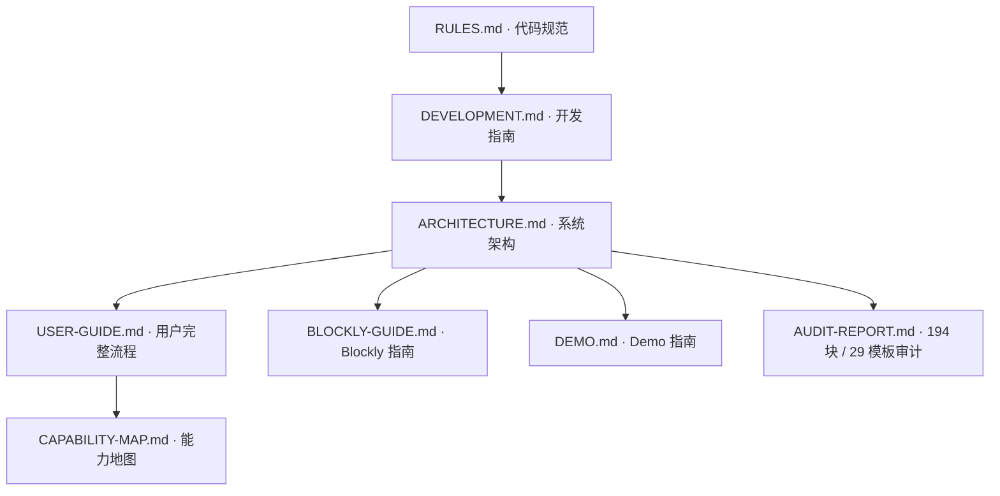

# CipherCat 文档中心

🐱 **后量子密码学可视化编程平台** — 基于 Blockly 13.x 和 Vue 3 (Composition API + TypeScript)。

---

## 文档索引

### 📖 用户文档

| 文档 | 受众 | 说明 |
|------|------|------|
| [USER-GUIDE.md](./guides/USER-GUIDE.md) | 用户 | 从创建项目、导入 Demo、连接积木到生成代码、验证和后端测评的完整使用路径 |
| [TUTORIALS.md](./guides/TUTORIALS.md) | 用户 | 按步骤学习编辑器、导入 Demo、生成代码、函数封装和提交测评；每步说明操作、界面状态、预期结果和排错 |
| [CAPABILITY-MAP.md](./guides/CAPABILITY-MAP.md) | 用户/研究者 | 按密码学家族查看已覆盖原语、算法、Demo、标准参考和边界 |
| [BLOCKLY-GUIDE.md](./guides/BLOCKLY-GUIDE.md) | 用户 | Blockly 使用指南：编辑器操作、类型系统、函数模板、算法拼装样例 |
| [DEMO.md](./guides/DEMO.md) | 用户 | 演示指南索引（按算法拆分：SM4/AES/哈希/SM2/后量子，含官方向量验证） |

积木块文档采用“一个总览 + 多个分类详情”：先看 [积木块总览](./blocks/INDEX.md)，再进入 [分组密码](./blocks/symmetric.md)、[哈希/XOF](./blocks/hash.md)、[经典公钥/椭圆曲线](./blocks/ecc-sbox.md)、[流密码](./blocks/zuc.md) 或 [后量子密码](./blocks/post-quantum.md)；每个分类页都提供标准原文、结构化条目、源码、Demo 和覆盖边界的证据入口。

### 🛠️ 开发文档

| 文档 | 受众 | 说明 |
|------|------|------|
| [ARCHITECTURE.md](./guides/ARCHITECTURE.md) | 开发者 | 系统架构、数据流、模块组织、类型系统 |
| [SETUP.md](./guides/SETUP.md) | 开发者 | 本地启动、生产预览、桌面构建和验收门禁 |
| [DEVELOPMENT.md](./guides/DEVELOPMENT.md) | 开发者 | 环境搭建、添加积木块步骤、i18n、代码风格 |
| [TYPE-SYSTEM.md](./guides/TYPE-SYSTEM.md) | 开发者 | Blockly 类型声明、实际连接检查规则与显式转换 |

### 📊 状态与审计

| 文档 | 受众 | 说明 |
|------|------|------|
| [AUDIT-REPORT.md](./guides/AUDIT-REPORT.md) | 开发者 | 密码原语完整性审计（含国密专项） |
| [CRYPTO-RESEARCH-2026-09-12.md](./research/CRYPTO-RESEARCH-2026-09-12.md) | 开发者/研究者 | 全网标准、后量子密码、实现保证、随机性测评和 Blockly 教学研究；含本地文献包 |

### 🔬 算法规范

覆盖矩阵（标准 ↔ 块 ↔ Demo ↔ 模板 ↔ 指南）：[standards/COVERAGE.md](./standards/COVERAGE.md)。文档提取质量、证据层级和缺项见 [standards/DOCUMENT-STATUS.md](./standards/DOCUMENT-STATUS.md)。标准原文提取层与结构化用户参照层的关系见 [standards/SOURCE-LAYERS.md](./standards/SOURCE-LAYERS.md)。标准元数据、来源核对日期、Errata 状态和本地 PDF 哈希由 [`standards-manifest.json`](./standards/standards-manifest.json) 与 `npm run standards:check` 维护。文档 i18n 按 `.en.md` 配对；英文翻译尚未存在的标准页在英文界面保留 source 语言 fallback，不伪装成已翻译文本。以下为 37 个算法标准目录；`standards/papers/` 是只保存研究材料索引的文献目录，不计入算法目录：

| 文档 | 说明 |
|------|------|
| [blocks/INDEX.md](./blocks/INDEX.md) | 积木块标准依据参考（按类目拆分） |
| [COVERAGE.md](./standards/COVERAGE.md) | 标准覆盖矩阵（标准 ↔ 块 ↔ Demo ↔ 模板 ↔ 指南） |
| [DOCUMENT-STATUS.md](./standards/DOCUMENT-STATUS.md) | 文档提取核验、证据层级与缺项清单 |
| [REEXTRACTION-REPORT.md](./standards/REEXTRACTION-REPORT.md) | 标准 PDF 重新提取、抽样视觉核验与修复记录 |
| [SOURCE-QUALITY-AUDIT.md](./standards/SOURCE-QUALITY-AUDIT.md) | 原文提取层的公式、表格、字体映射和可读性分级 |
| [FUNCTION-PRIMITIVE-INDEX.md](./standards/FUNCTION-PRIMITIVE-INDEX.md) | 标准文档按函数/原语族的结构化拆分索引 |
| [STRUCTURED-ENTRY-SCHEMA.md](./standards/STRUCTURED-ENTRY-SCHEMA.md) | 函数、原语、公式和算法阶段的统一条目字段 |
| [SOURCE-SPLIT-COVERAGE.md](./standards/SOURCE-SPLIT-COVERAGE.md) | source 原文到结构化条目的覆盖审计与验收标准 |
| [SOURCE-SPLIT-INVENTORY.md](./standards/SOURCE-SPLIT-INVENTORY.md) | 37 个标准目录、227 个结构化条目的逐项 source 回链清单 |
| [fips197-AES/](./standards/fips197-AES/README.md) | FIPS 197 AES 算法参考 |
| [fips180-4-SHA2/](./standards/fips180-4-SHA2/README.md) | FIPS 180-4 SHA-2 算法参考 |
| [fips202-SHA3/](./standards/fips202-SHA3/README.md) | FIPS 202 SHA-3 / SHAKE / KECCAK-p |
| [fips198-1-hmac/](./standards/fips198-1-hmac/README.md) | FIPS 198-1 HMAC 消息认证码 |
| [sp800-38a-modes/](./standards/sp800-38a-modes/README.md) | SP 800-38A 分组密码模式 (ECB/CBC/CTR) |
| [sp800-38b-cmac/](./standards/sp800-38b-cmac/README.md) | SP 800-38B CMAC 消息认证码 |
| [sp800-38c-ccm/](./standards/sp800-38c-ccm/README.md) | SP 800-38C CCM 认证加密 |
| [sp800-38d-gcm/](./standards/sp800-38d-gcm/README.md) | SP 800-38D GCM 认证加密 |
| [sp800-38e-xts/](./standards/sp800-38e-xts/README.md) | SP 800-38E XTS 磁盘加密 |
| [sp800-90a-drbg/](./standards/sp800-90a-drbg/README.md) | SP 800-90A DRBG 随机数发生器 |
| [sp800-132-pbkdf2/](./standards/sp800-132-pbkdf2/README.md) | SP 800-132 PBKDF2 密钥派生 |
| [sp800-232-ascon/](./standards/sp800-232-ascon/README.md) | SP 800-232 ASCON 轻量认证加密 |
| [fips186-5-ecdsa/](./standards/fips186-5-ecdsa/README.md) | FIPS 186-5 ECDSA 数字签名 |
| [fips203-ML-KEM/](./standards/fips203-ML-KEM/README.md) | FIPS 203 ML-KEM (Kyber) |
| [fips204-ML-DSA/](./standards/fips204-ML-DSA/README.md) | FIPS 204 ML-DSA (Dilithium) |
| [fips205-SLH-DSA/](./standards/fips205-SLH-DSA/README.md) | FIPS 205 SLH-DSA 无状态哈希签名 |
| [mceliece-goppa/](./standards/mceliece-goppa/README.md) | McEliece / Goppa 码（基于纠错码的公钥密码） |
| [rfc4648-base64/](./standards/rfc4648-base64/README.md) | RFC 4648 Base64 编码 |
| [rfc2315-pkcs7/](./standards/rfc2315-pkcs7/README.md) | RFC 2315 PKCS#7 填充 |
| [rfc5869-hkdf/](./standards/rfc5869-hkdf/README.md) | RFC 5869 HKDF 密钥派生 |
| [rfc7748-x25519/](./standards/rfc7748-x25519/README.md) | RFC 7748 X25519 密钥交换 |
| [rfc8017-pkcs1/](./standards/rfc8017-pkcs1/README.md) | RFC 8017 PKCS#1 RSA 加解密/签名 |
| [rfc8032-eddsa/](./standards/rfc8032-eddsa/README.md) | RFC 8032 EdDSA 数字签名 |
| [rfc5903-ecdh/](./standards/rfc5903-ecdh/README.md) | RFC 5903 ECDH 密钥协商 (P-256) |
| [rfc9106-argon2/](./standards/rfc9106-argon2/README.md) | RFC 9106 Argon2 密码哈希 |
| [gbt32905-SM3/](./standards/gbt32905-SM3/README.md) | GB/T 32905 SM3 国密哈希 |
| [gbt32907-SM4/](./standards/gbt32907-SM4/README.md) | GB/T 32907 SM4 国密分组密码 |
| [gbt32918-SM2/](./standards/gbt32918-SM2/README.md) | GB/T 32918 SM2 国密公钥密码 |
| [gmt0005-randomness/](./standards/gmt0005-randomness/README.md) | GM/T 0005 随机性检测（Go 后端） |
| [gbt33133-ZUC/](./standards/gbt33133-ZUC/README.md) | GB/T 33133 ZUC 序列密码 |
| [gbt36624-aead/](./standards/gbt36624-aead/README.md) | GB/T 36624 可鉴别加密 |
| [gbt38635-SM9/](./standards/gbt38635-SM9/README.md) | GB/T 38635 SM9 标识密码 |
| [gbt15852-mac/](./standards/gbt15852-mac/README.md) | GB/T 15852 MAC 消息认证码 |
| [gbt17964-modes/](./standards/gbt17964-modes/README.md) | GB/T 17964 分组密码模式 |
| [gmt0091-kdf/](./standards/gmt0091-kdf/README.md) | GM/T 0091 密钥派生 |
| [gmt0103-rng/](./standards/gmt0103-rng/README.md) | GM/T 0103 随机数发生器 |
| [china-pqc-tracking/](./standards/china-pqc-tracking/README.md) | 中国抗量子密码公开进展 |
| [papers/](./standards/papers/README.md) | 标准版本、研究材料和本地文献包索引（非算法实现目录） |

### 📝 规范文件（根目录）

| 文件 | 说明 |
|------|------|
| [README.md](../README.md) | 项目介绍、快速开始 |
| [RULES.md](../RULES.md) | 工程行为准则 |
| [eslint.config.js](../eslint.config.js) | ESLint 规则 |
| [tsconfig.json](../tsconfig.json) | TypeScript 配置 |
| [package.json](../package.json) | 依赖与脚本 |

---

## 文档关系图

## 文档写作与命名规范

用户文档和开发文档使用说明文体与任务步骤，不使用问答或聊天记录形式。英文标题统一使用 sentence case；产品名、编程语言、标准、算法名和积木标识保留规范大小写，例如 Blockly、JavaScript、Python、JSON、XML、AES、SM3、ZUC、ML-KEM 和 ML-DSA。中文正文将已登记的工作区统一称为 `Demo`，文件系统路径 `demos/` 保持原样。标准原文、公式和伪代码保留来源文档的原始表述。

---

## 项目概览

- **前端框架**: Vue 3 (Composition API + TypeScript)
- **可视化编程**: Blockly 13.x
- **桌面封装**: Tauri 2.x
- **构建工具**: Vite + vue-tsc
- **代码规范**: ESLint 9.x + RULES.md
- **本地存储**: IndexedDB
- **代码生成**: JavaScript / Python
