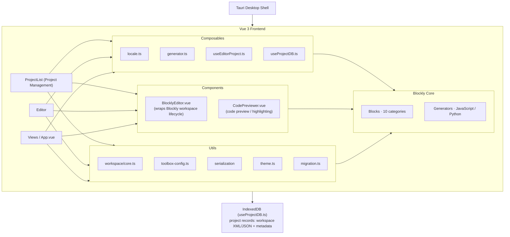

# CipherCat System Architecture


## Overall Architecture



---

## Vue 3 Frontend + Blockly Integration Pattern

CipherCat does not use a heavyweight third-party Blockly-Vue wrapper library. Instead, it manages the Blockly workspace lifecycle directly through Vue components:

```
BlocklyEditor.vue (component)
├── onMounted
│   └── workspaceApi.initWorkspace(container)
│       ├── Blockly.inject(container, {toolbox, theme, ...})
│       └── Register the S-Box category callback
├── Exposed methods (defineExpose)
│   ├── exportWorkspace / loadWorkspace
│   ├── clearWorkspace / zoomIn/Out/Reset
│   └── setTheme / refreshBlocks
└── Event listeners
    └── workspace.addChangeListener → emit('change')
        → handled by App.vue → update save status / autosave
```

**Key design principles**:
- The Blockly workspace is a "controlled component" — all operations are wrapped through the `utils/workspace/` layer
- Vue components do not touch the Blockly DOM directly; the Composables layer bridges the two
- Workspace changes bubble up to App.vue as events, triggering storage/state updates

---

## Module Organization

### Block Definitions (`src/blocks/`)

Organized into 11 categories by cryptographic domain, each with its own `index.ts` exporting types and block definitions:

| Directory | Category | Description |
|------|------|------|
| `ctrl/` | Control flow | Loops (`ctrl_iterate`) |
| `data/` | Data & conversion | Numbers, type conversions, bit/byte lengths, seed generation |
| `array/` | Arrays | Partition utilities (`arr_partition_to_array`) |
| `logic/` | Logic operations | Compound logic (AND/OR/XOR/NOT) |
| `bitwise/` | Bit operations | AND/OR/XOR/NOT/shifts/rotations/byte substitution |
| `sbox/` | S-Box | Dynamic S-Box definition and substitution (CSV import/export support) |
| `hash/` | Hashing & padding | SM3/SHA-256/SHA-3 padding and compression, SHAKE XOF/PRF |
| `numtheory/` | Number theory | NTT/INTT/Montgomery reduction, elliptic curves, modular inverse |
| `ecc/` | Elliptic curves | Curve parameters, point add/double/multiply |
| `post-quantum/` | Post-quantum | Basics (encode/decode/compress) + advanced (sampling/NTT/vector operations) |
| `procedure/` | Function wrappers | Cryptographic function templates, standalone return blocks, import/export |

All block types are aggregated into the `ALL_BLOCK_TYPES` union type in `src/blocks/index.ts`.

### Type System (`src/constants/block-types.ts`)

CipherCat defines **cryptographic domain type constants** used for Blockly's `setCheck()`/`setOutput()` connection constraints:

| Type constant | Blockly type string | Semantics |
|---------|-------------------|------|
| `TYPE_BYTES` | `Bytes` | Byte sequence |
| `TYPE_INT_LIST` | `IntList` | Integer list / polynomial coefficients |
| `TYPE_SBOX` | `SBox` | S-box lookup table |
| `TYPE_NUMBER` | `Number` | Blockly native number |

The type system also includes a **`TYPE_MAP`** mapping table that defines the underlying language alignment across Blockly ↔ Python ↔ JavaScript:

| Blockly | Python | JavaScript |
|---------|--------|-----------|
| `Bytes` | `bytes` | `Uint8Array` |
| `IntList` | `list[int]` | `number[]` |
| `Number` | `int` | `number` |
| `SBox` | `list[list[int]]` | `number[][]` |

### Code Generators (`src/generators/`)

A directory structure mirroring `blocks/`:

```
src/generators/
├── javascript/
│   ├── index.ts            ← imports all JS generators
│   ├── ctrl/ data/ array/  ← corresponding to blocks categories
│   ├── bit/ logic/ sbox/
│   └── postquantum/
└── python/
    ├── index.ts            ← imports all Python generators
    └── (same mirrored structure as above)
```

Each generator file registers its generation functions via `javascriptGenerator.forBlock['block_type']` or `pythonGenerator.forBlock['block_type']`.

### Utility Functions (`src/utils/`)

| File | Responsibility |
|------|------|
| `workspace/core.ts` | Blockly workspace creation, destruction, theme switching |
| `workspace/serialization.ts` | XML/JSON serialization/deserialization, file upload/download, S-Box field migration |
| `workspace/theme.ts` | Custom Blockly themes (light/dark) |
| `workspace/index.ts` | `Workspace()` factory function wrapping all workspace operations |
| `toolbox-config.ts` | Dynamic toolbox configuration (category names based on `Blockly.Msg` i18n) |
| `migration.ts` | Block type migration map (compatibility with legacy block names) |
| `errorHandler.ts` | Unified error handling |

### Composables (`src/composables/`)

| File | Responsibility |
|------|------|
| `locale.ts` | Internationalization: Blockly language packs + custom UI messages + block labels |
| `generator.ts` | Calls `javascriptGenerator.workspaceToCode()` / `pythonGenerator.workspaceToCode()` |
| `useEditorProject.ts` | Editor project management: load/save/new/autosave |
| `useProjectDB.ts` | IndexedDB CRUD operations (`getAllProjects`, `saveProject`, `deleteProject`, etc.) |

### Constants (`src/constants/`)

| File | Responsibility |
|------|------|
| `code-languages.ts` | Supported language enum (Python / JavaScript) |
| `workspace-config.ts` | Blockly workspace configuration (grid, zoom, scrollbars, etc.) |
| `block-types.ts` | Cryptographic type constants (Bytes/IntList/SBox) + TYPE_MAP language alignment table |

---

## Code Generation Pipeline

```
User drags blocks
       │
       ▼
Blockly workspace (WorkspaceSvg)
       │
       ├── javascriptGenerator.workspaceToCode(workspace)
       │       │
       │       ▼
       │    JavaScript code string
       │
       └── pythonGenerator.workspaceToCode(workspace)
               │
               ▼
            Python code string
                │
                ▼
        CodePreviewer.vue (highlight.js highlighting)
                │
                ├── Copy to clipboard
                └── Manually save to file
```

Generation functions are invoked uniformly through `generateCode(workspace, language)` in `generator.ts`.

---

## Key Data Flows

```
1. User drags blocks onto the workspace
       │
       ▼
2. Blockly fires a change event
       │
       ▼
3. BlocklyEditor.vue → emit('change')
       │
       ▼
4. App.vue: handleWorkspaceChanged()
       │
       ├─ mark saveStatus = 'unsaved'
       │
       └─ if autosave is enabled:
              │
              ▼
          after 1.5 s → useEditorProject.doSave()
              │
              ▼
          IndexedDB.saveProject(record)
              │
              ▼
          Serialize the workspace to XML,
          store as {id, name, workspace, format, language, timestamps}
```

Export flow:
```
User clicks "Export" → exportWorkspace(format)
                  │
                  ├─ XML mode: Blockly.Xml.domToText(Blockly.Xml.workspaceToDom(workspace))
                  └─ JSON mode: Blockly.serialization.workspaces.save(workspace)
                             → downloaded as a .xml / .json file (Tauri file dialog or browser download)
```

---

## Internationalization (i18n) Strategy

CipherCat uses **two-layer i18n**:

### Layer 1: Built-in Blockly Mechanism

`Blockly.setLocale()` switches Blockly's built-in language packs (`blockly/msg/zh-hans` / `en`).
Labels, tooltips, and menus of built-in blocks switch automatically.

### Layer 2: Custom Message System (`src/composables/locale.ts`)

- `MESSAGES_ZH_HANS` / `MESSAGES_EN`: block labels (e.g. `CRYPTO_BITWISE_AND`, `CRYPTO_SHA3_KECCAK_F_TOOLTIP`)
- `UI_MESSAGES`: UI text (buttons, hints, status)
- `BLOCKLY_OVERRIDES_ZH_HANS`: custom overrides for Blockly's built-in Chinese strings
- `ui(key)`: gets the UI message for the current language
- `useBlocklyLocale()`: reactive locale switching, automatically refreshes the workspace

**When adding a new block**, you must add the corresponding translation keys to both `MESSAGES_ZH_HANS` and `MESSAGES_EN`.

---

## Project Storage (IndexedDB)

Database name: `blockly-crypto-editor` / object store: `projects`

```typescript
interface ProjectRecord {
  id?: number;         // auto-increment primary key
  name: string;        // project name
  workspace: string;   // serialized XML workspace content
  format: 'json' | 'xml';
  language: string;    // code language
  createdAt: string;   // ISO timestamp
  updatedAt: string;   // ISO timestamp
}
```

Accessed through the async CRUD operations in `useProjectDB.ts`, with autosave support (1.5 s debounce).

---

## Cross-Platform Considerations

| Capability | Web browser | Tauri desktop |
|------|-----------|-----------|
| Editor | Blockly workspace ✅ | Fully identical ✅ |
| Storage | IndexedDB | IndexedDB (current approach) |
| File import/export | Browser File API / download | Tauri `dialog.save` + `fs.writeTextFile` |
| Performance | Limited by the browser | Native window, better |
| Packaging | Vite build | `npm run tauri:build` |

The current codebase switches file read/write strategies at runtime by detecting the environment in `serialization.ts` (`window.__TAURI__` or `window.showDirectoryPicker`), so the same code works on both Web and Tauri.

---

## Routing

```typescript
// src/router/index.ts
const routes = [
  { path: '/',             name: 'ProjectList', component: ProjectList },
  { path: '/editor/:id',   name: 'Editor',      component: App.vue     },
];
```

- `/` — Project management page: create, open, delete projects
- `/editor/:id` — Editor main view: Blockly workspace + code preview panel
