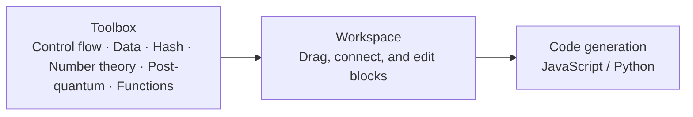
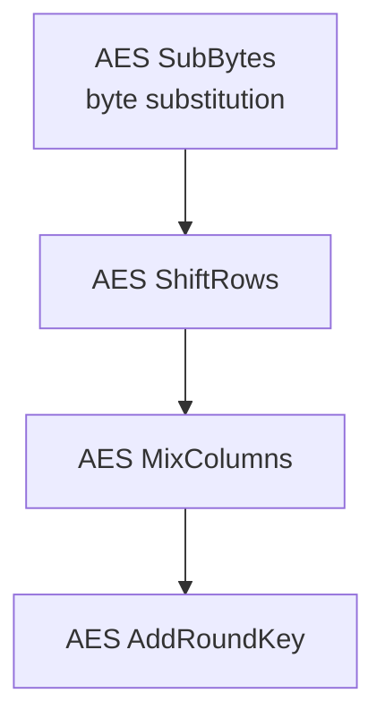

# Blockly usage guide


Build crypto algorithms with the Blockly 13 visual editor: drag blocks, connect by type, generate Python / JavaScript with one click. This guide covers editor operations, the type system, function templates, and algorithm assembly examples.

---

## 1. Interface overview



- **Toolbox**: category list on the left. Click a category to reveal blocks, drag one onto the workspace.
- **Workspace**: central canvas. Zoom with Ctrl+scroll, pan by dragging.
- **Generate**: toolbar button that translates the workspace into JavaScript or Python.


_Figure: The actual page shows the toolbox, connected workspace chain, and code area together; the screenshot documents control locations and does not replace generator tests._

## 2. Basic operations

| Action | How |
|--------|-----|
| Add block | drag from toolbox to workspace |
| Connect | drag a block's plug (value/statement input) onto another block's socket (output); connect on highlight |
| Disconnect | drag the connected block away |
| Delete | right-click → Delete (or drag to trash / press Delete) |
| Duplicate | right-click → Duplicate |
| Undo/Redo | Ctrl+Z / Ctrl+Shift+Z |
| Zoom | Ctrl+scroll / right-click → Zoom |
| Clean up | right-click → Clean up blocks (auto-arrange) |

## 3. Data and type system

Crypto blocks carry type annotations; **mismatched types refuse to connect** (Blockly connection checks):

| Type | Meaning | Typical blocks |
|------|---------|----------------|
| `Bytes` | byte sequence | `data_bytes_from_hex`, hash inputs |
| `IntList` | integer array (finite-field coefficients, etc.) | `pq_sample_poly_cbd`, `pq_ntt` |
| `Number` | scalar integer | `math_number`, modulus params |
| `SBox` | S-box lookup table (CSV import) | `sbox_define` |

On mismatch the plug turns red and connection is blocked — the first line of defense against algorithm-semantic errors.

**Variables**: create variables (e.g. `state`, `rk`, `block`) in the Variables category. Crypto blocks are mostly pure (return new values rather than mutating variables), which keeps generated code verifiable.

## 4. Functions and algorithm templates

### 4.1 Custom functions

The Functions category uses Blockly's native procedure system:

- **＋New**: inserts a function definition with typed parameters (gear ⚙ mutator adds/removes params)
- Function body is assembled from atomic blocks; `RETURN` yields the result
- Call: drag a **call block**, pick the function from the dropdown; params sync automatically

### 4.2 Algorithm templates (function manager)

The "Crypto Templates / Function Manager" area provides **29 visual templates and algorithm scaffolds**, including AES/SM4 rounds and key-schedule fragments, hashing, HMAC, PBKDF2, and ML-KEM KeyGen/Encaps. Dragging one in pre-fills only its represented fragment; not every template is a complete, validated end-to-end algorithm:

- AES templates provide a single-round structure; the key-expansion template is currently only a `ctrl_iterate` loop scaffold, not a complete AES-128 key schedule or encryption flow
- Other loop templates may prefill `ctrl_iterate` loops (e.g. 10/16/32 iterations); inspect each template's contents and algorithm boundary
- Template parameters (key/iv/nonce, etc.) remain open for connection to data blocks.

> Templates are **teaching aids that reveal algorithm structure**: every atomic step is visible and inspectable after dragging out.

### 4.3 Function manager panel

Toolbar "Function Manager": ＋new function, 📥 import (.json), 📤 export, and add/remove templates from the toolbox (＋📦).


_Figure: The function Demo shows the parameter, function body, and return-value state._

## 5. Code generation

Choose **▶ Generate** and select Python or JavaScript. Generated code includes the required helpers. Example — an SM3 hash workspace generates:


_Figure: The code panel is the viewing and copying entry point for generated code._

```python
def hash_sm3_pad(msg):  # ...
    ...
def sm3_compress(v, block):  # ...
    ...
result = sm3_compress(IV, hash_sm3_pad(b"abc"))
```

Official-vector verification: the 4 demos in `demos/procedures/` (SM4-Sbox / SM3-Hash / SM2-PointMul / ML-KEM-Encaps) generate output matching official test vectors in both languages (see `scripts/verify-demo.ts`).

## 6. Import and export

- **Workspace import**: menu → Import Workspace → pick `.json` (Blockly standard serialization)
- **Workspace export**: menu → Export Workspace → save `.json`
- **Function export**: Function Manager → select → 📤 export `.json`
- **Samples**: `demos/` ships atomic-block workspaces (`demos/README.md` is the authoritative index)

To avoid stack overflow in Blockly's recursive serialization, workspace import and export are limited to 256 nested block levels. Operations exceeding the limit are rejected without replacing the current workspace.

## 7. Algorithm assembly examples

> Full walkthroughs: [DEMO.en.md](./DEMO.en.md) and `docs/demos/{sm4,aes,hash,sm2,post-quantum}.en.md`. Minimal runnable chains below.

### 7.1 SM4 S-box lookup

```text
sm4_sbox( 0x01 )  →  0x90   (GM/T 0002 official vector)
```

### 7.2 SM3 hash

```text
hash_sm3_pad("abc")  →  64-byte padded block
sm3_compress(IV, block)  →  66c7f0f4…ba8e0 (GB/T 32905 official vector)
```

### 7.3 AES-128 single round



### 7.4 ML-KEM-512 Encaps (FIPS 203)

1. Parse `ek`: `t̂ = ByteDecode₁₂(ek[0:768])`, `ρ = ek[768:800)`.
2. Compute `K = G(m ‖ H(ek))` and take the first 32 bytes (`SHA3-512`).
3. Compute `Â ← SampleNTT(ρ)` by concatenating `ρ‖j‖i` with `pq_seed_with_nonce`.
4. Generate `ŝ`, `e₁`, and `e₂` with `pq_sample_poly_cbd` and distinct nonces.
5. Compute `u = INTT(Âᵀ∘ŝ) + e₁` and `v = INTT(t̂ᵀ∘ŝ) + e₂ + Decompress₁(m)`.
6. Compute `c = ByteEncode₁₀(Compress₁₀(u)) ‖ ByteEncode₄(Compress₄(v))`.

> ML-KEM has no matrix block; unroll `ntt_mul` + `poly_add` for k=2. t̂ from ek is already in NTT domain — **do NOT apply NTT again**.

## 8. Troubleshooting

| Issue | Fix |
|-------|-----|
| Plug turns red, won't connect | type mismatch (check Bytes/IntList/Number) |
| Template chain incomplete after drag | template inputs (key/iv/nonce) are open; fill with data blocks |
| Generated code errors | check the template is on the main workspace (flyout preview doesn't generate) |
| Result verification | open `demos/procedures/*.json` and choose ▶ Generate against official vectors |
